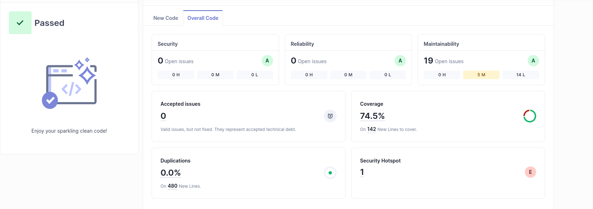
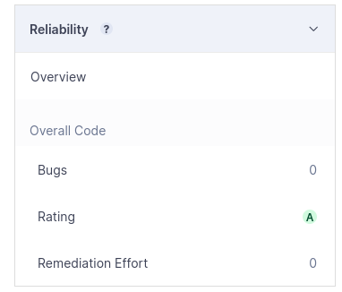
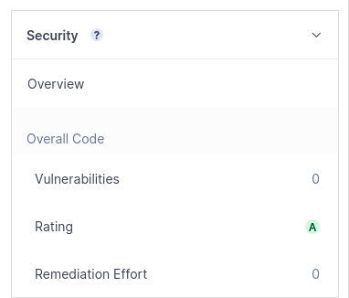
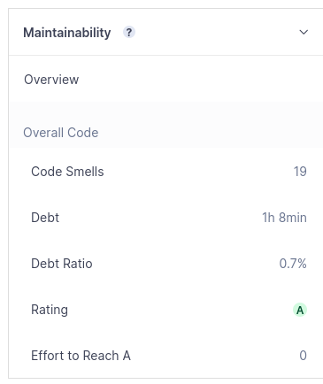

My project passed the defined quality gates:

As seen in the images the project passed the quality gate with 74.5 % of the code covered by tests, 0 bugs, 0 vulnerabilities and 0 code smells of high severity(still having some code smells but none of them are of high severity).

| Issue         | Problem Description                                                  | How to solve                                                                                                                                |
|---------------|----------------------------------------------------------------------|---------------------------------------------------------------------------------------------------------------------------------------------|
| Bug           |                                                                      |                                                                                                                                             |
| Vulnerability |                                                                      |                                                                                                                                             |
| Code Smell    | There are some code smells (19) but none of them is Severe.          | Erasing not used imports, removing the public in the tests for not being needed in junit5                                                    |
