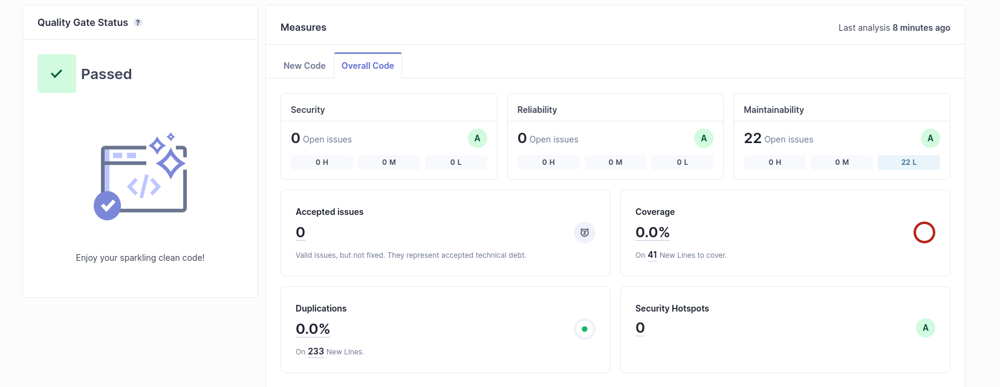
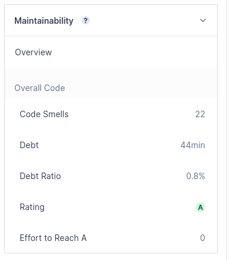
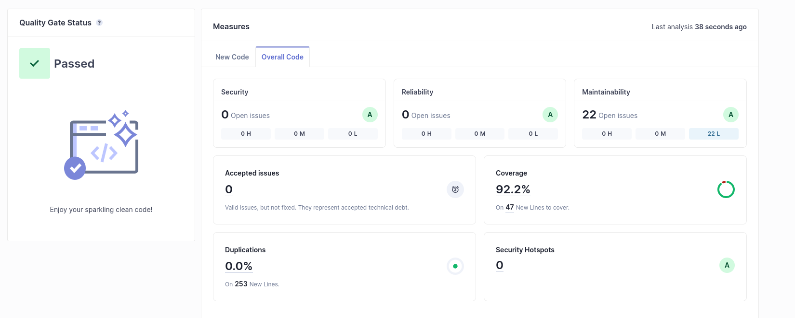

My project passed the defined quality gates:

                                                |

a) techincall debt is the estimative of time for correcting the errors/optimize the code
b) code smeels are insignificant
c) praticly nothing to be covered