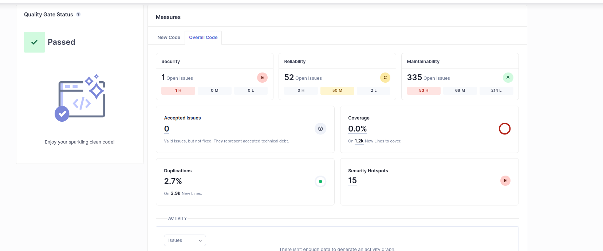
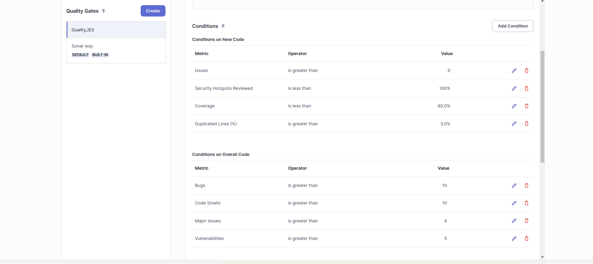
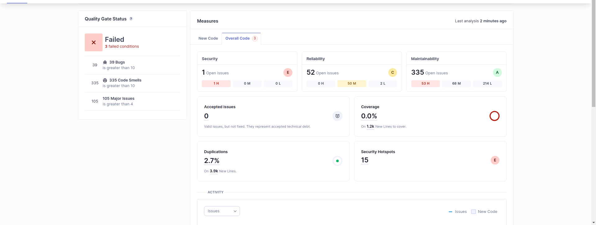

### At first, i tested the Quality Assurance with the default quality gate from sonarQube and this is what i got:

### Then, with the help of the collegues that made the IES project with me, we made a new Quality Gate with the following conditions:

### With the new Quality Gate:

- After analyzing the results, we concluded that implementing tests would have significantly mitigated the issues we encountered. With numerous features in play, manually tracking whether everything was functioning correctly became an impossible task.

